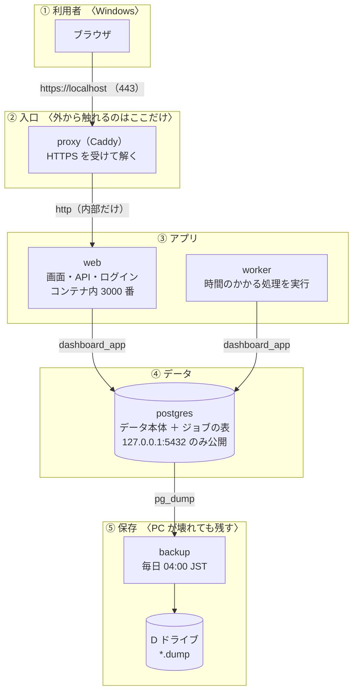
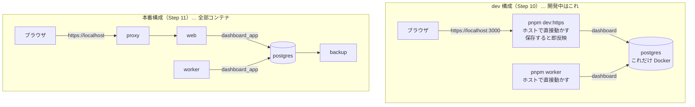
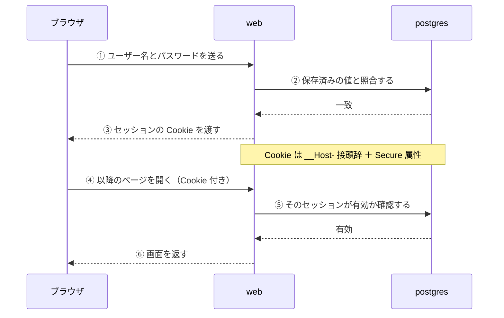
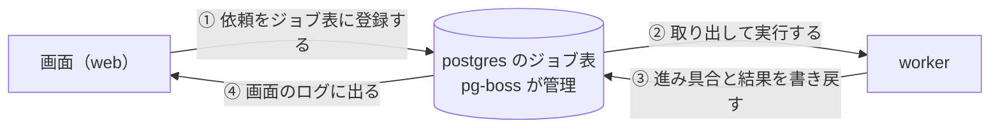
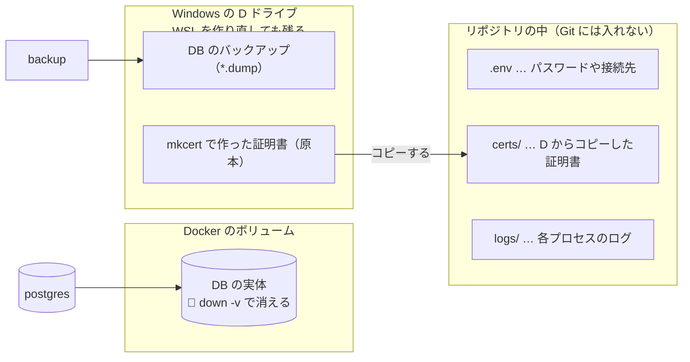
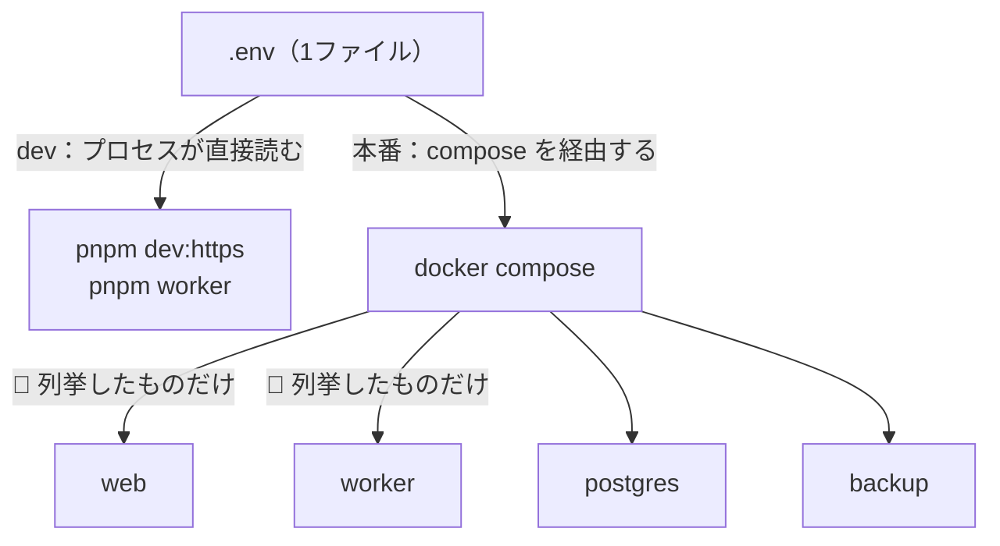
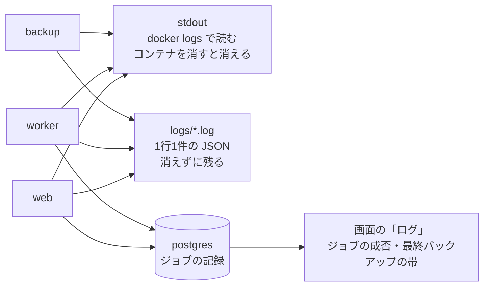
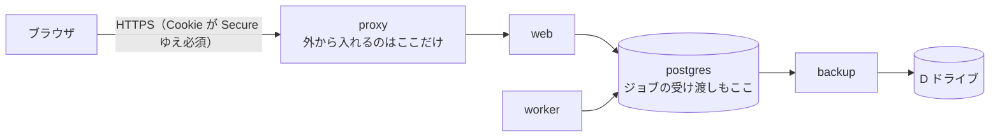

# 個人用ダッシュボード — 機能構成図

> **この文書について**
> - `SETUP.md`（環境構築手順）の**付録**です。手順を読む前／読みながら、「何と何がどう繋がっているのか」を見るための図をまとめました。
> - **`SETUP.md` に書かれている範囲だけ**を図にしています（アプリのソースコードは同梱していないため、中の作りには踏み込みません）。
> - 図の中の箱は、**そのまま `docker compose ps` に出てくるサービス名**です。手順の中で名前を見かけたら、この図に戻ってきてください。

> 📌 **図の見方（Mermaid 記法）**
> 図は Mermaid という記法で書いてあります。**GitHub 上ではそのまま図として表示**されます。
> **VSCode でプレビューする場合**は、拡張 **Markdown Preview Mermaid Support**（`bierner.markdown-mermaid`）を入れてから <kbd>Ctrl</kbd>+<kbd>Shift</kbd>+<kbd>V</kbd> を押してください。
> 入れずに開くと、図の部分はコードのまま表示されます（内容は読めますが、線では繋がりません）。

---

## 1. 全体像（本番構成 ＝ `SETUP.md` の Step 11）

**上から下へ「外 → 内」の順**に5つの層で並べてあります。**外から触れるのは ② だけ**です。

📌 **②〜⑤は、すべて WSL2 の Docker の中**で動いています（① の ブラウザだけが Windows 側です）。
📌 **③ の `web` と `worker` は、同じ層にいる仲間**です。役割が違うだけで、どちらも ④ の DB を使います。
📌 メール・翻訳などの**任意機能を使うときだけ**、③ から外部サービス（メール事業者・Azure）へ出ていきます。常時の通信ではないので、この図からは省いています。

**読み方**:

| 箱 | 役割 | 外から直接触れるか |
|---|---|---|
| `proxy` | HTTPS を受けて `web` へ渡す（Caddy） | **ここだけ**（443） |
| `web` | 画面と API。ログインもここ | いいえ（`proxy` 経由） |
| `worker` | 時間のかかる処理を裏で実行 | いいえ |
| `postgres` | データの本体。ジョブの表も持つ | いいえ（PC 内からのみ） |
| `backup` | 1日1回 DB を書き出す | いいえ |

🔴 **`web` と `worker` は、どちらも同じ `postgres` を見ます。** この2つは直接は会話せず、**DB を挟んで**やり取りします（→ 4.）。

---

## 2. 同じコードの、2通りの動かし方

- **アプリのコードは両方で同じ**です。違うのは「誰が HTTPS を終端するか」「どのロールで DB に繋ぐか」「コード変更の反映方法」だけです。
- **`postgres` は両方で同じものを使い回します**（dev で入れたデータが本番構成でもそのまま見えます）。
- 🔴 **dev の `pnpm worker` と本番の `worker` を同時に動かさない**。同じジョブを2つで取り合います。

---

## 3. ログインの流れ（なぜ HTTPS が必須なのか）

- **`Secure` が付いた Cookie は HTTPS でしか送られません。** だから **HTTP で開くとログインが成立しません**。
- これが、ローカル開発でも mkcert で HTTPS にしている理由です（`SETUP.md` の Step 7）。
- 🔴 **「ログインできるのに、すぐログアウトされる」ときは、まず URL が `http://` になっていないか**を見てください。

---

## 4. ジョブの流れ（`web` と `worker` の分担）

- **時間のかかる処理を画面側でやらない**のが基本の形です。画面は「依頼を置く」だけで応答を返し、実際の実行は `worker` が受け持ちます。
- **依頼の受け渡しも DB の中**（`pg-boss` 用のスキーマ）で行います。そのため専用のキューサーバー（Redis など）は要りません。
- `worker` が落ちている間、依頼は DB に残ります。**起動し直せば続きから処理されます**。

---

## 5. データの置き場所（消えると困るものの所在）

- **データを D ドライブに置くのは、WSL を作り直しても失われないようにするため**です。コンテナへは「ホスト側の実体」を渡して（バインドマウント）使います。
- 🔴 **渡す先のディレクトリは、先に自分で作っておきます**（`SETUP.md` の Step 9）。作らずに起動すると、Docker が root 所有で勝手に作り、後から「書き込めない」で詰まります。
- 🔴 **`.env` と `certs/` は Git に入れない**（`.gitignore` 済み）。特に証明書の**秘密鍵**は共有しない。

---

## 6. 設定（`.env`）はどうやってコンテナに届くか

- 🔴 **「`.env` に書いたのに効かない」の多くはここ**です。本番構成では、`.env` に書いただけでは足りず、**compose 側にも書き足す**必要があります。
- 変更を反映するときは `restart` ではなく**作り直し**（`up -d web worker`）。
- 🔴 **`web` と `worker` の両方で使う値は、両方に同じ値を渡す**（メールの暗号鍵・翻訳のキーなど）。片方だけだと、その経路でだけ静かに失敗します。

---

## 7. ログの流れ（どこを見れば分かるか）

- **同じ内容が2か所に出ます。** その場で見るなら `docker logs`、後から追うなら `logs/` のファイルです。
- **`backup` は黙って止まることがあり得る**ので、画面側に「最終バックアップ」の帯が出ます。**36時間更新が無いと黄色い警告**に変わります。
- 🔴 **「ジョブが成功していること」と「中で全部うまくいったこと」は別**です。失敗しても止めない処理（翻訳など）は、ジョブ自体は成功のまま終わります。だから画面に帯を出して知らせる作りにしています。

---

## 8. まとめ（1枚だけ覚えるなら）

**3つだけ押さえる**:

1. **外から入れるのは `proxy` だけ**。他は内側に隠れています。
2. **`web` と `worker` は DB を挟んで会話する**。直接は繋がりません。
3. **消えると困るものは D ドライブと `logs/`**。DB の実体はボリュームにあり、`down -v` で消えます。
