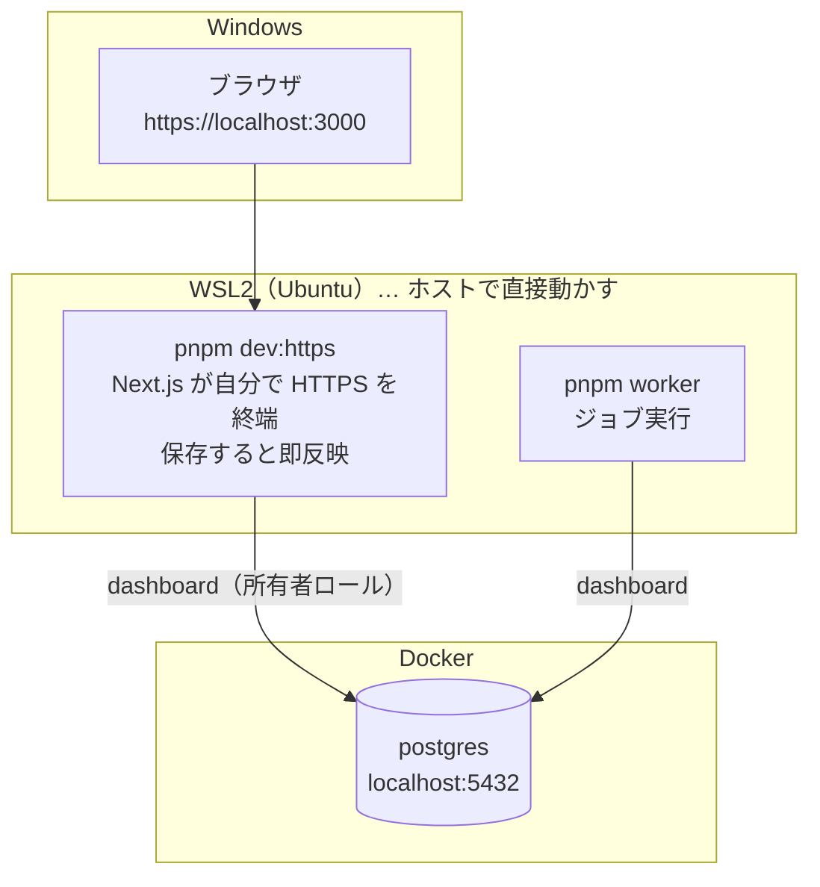
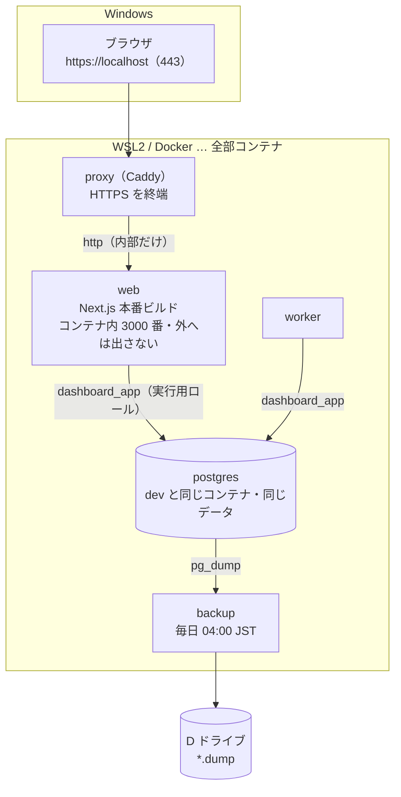
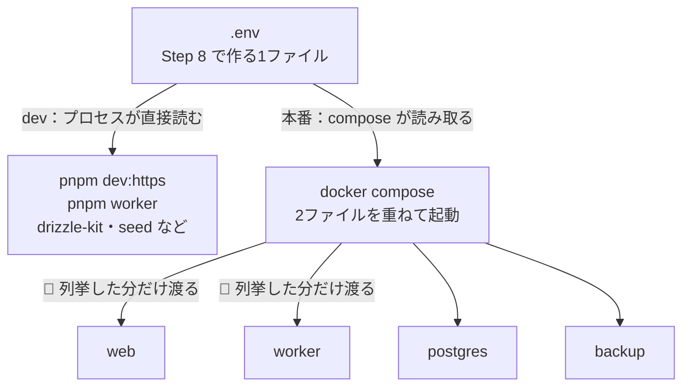

# 個人用ダッシュボード — 環境構築手順（SETUP）

> **扱う範囲**: 新しい PC でゼロから動かすまで
> **対象 OS**: Windows 11 Pro ＋ WSL2（Ubuntu 24.04）

> 📌 **この文書について（はじめに読んでください）**
> - 個人で作っている Web アプリ（Next.js ＋ PostgreSQL ＋ Docker）の環境構築手順を、**学習用に抜き出したもの**です。
> - **Step 5 以降の多くはアプリのリポジトリ（ソースコード）が手元にある前提**です。リポジトリは同梱していないので、その部分は「実際のアプリはこういう構成・順番で組まれている」という**読み物**として読んでください。どこまで手元で実行できるかは下の「0.」にまとめています。
> - 文中で **「※本書には未収録」** と付いている文書・手順は同梱していません（読み飛ばして大丈夫です）。

> 📌 **図の見方（Mermaid 記法）**
> 図は Mermaid という記法で書いてあります。**GitHub 上ではそのまま図として表示**されます。
> **VSCode でプレビューする場合**は、拡張 **Markdown Preview Mermaid Support**（`bierner.markdown-mermaid`）を入れてから <kbd>Ctrl</kbd>+<kbd>Shift</kbd>+<kbd>V</kbd> を押してください（拡張の入れ方は Step 6-4 と同じ要領です）。

---

## 0. この文書の読み方（最初にここだけ読む）

**流れ**: OS 準備 → 開発ツール → **dev 構成** → **本番構成**

**到達点は2段階あります。**

| | 範囲 | 終わるとどうなるか |
|---|---|---|
| **手元で実行できる範囲** | Step 1〜4・6・7 ＋ **寄り道** | 開発ツール（WSL・Docker・Node・Git・VSCode・mkcert）が揃い、**練習用の空の Next.js を `https://localhost:3000` で「安全な接続」として開ける**。🔴 このアプリ（ダッシュボード）の画面は、コードが無いので開けません |
| **読み物の範囲**（リポジトリがある場合） | Step 5・8〜12 | ブラウザでログインでき、タスク・収支・株価・ログが使える。DB が毎日自動バックアップされる |

### 各ステップの書き方

```
【WSL】または【PowerShell】  ← どこで打つコマンドかを必ず先頭に書いています
✅ 確認: 「こう出れば成功」という判定基準
🔴 つまずいたら: よくある失敗と対処
```

- 断りがなければ **WSL の Ubuntu 端末**で、**`~/dev/dashboard` に居る状態**で実行します。
- **ブラウザは Windows 側**を使います（WSL2 は `localhost` を Windows と共有するので、そのまま繋がります）。
- 📌 **知らない言葉が出てきたら、末尾の「付録 E. 用語ミニ辞典」**を見てください（コンテナ・ボリューム・ロールなど、この文書に出てくる用語だけをまとめてあります）。

### 進捗チェックリスト（本編）

- [ ] Step 1　WSL2（Ubuntu 24.04）
- [ ] Step 2　Docker Desktop
- [ ] Step 3　Node 24 ＋ pnpm
- [ ] Step 4　Git / GitHub CLI
- [ ] Step 5　リポジトリを取得
- [ ] Step 6　VSCode ＋ Claude Code（推奨）
- [ ] Step 7　mkcert（HTTPS 証明書）
- [ ] 寄り道　空の Next.js を動かしてみる（リポジトリ不要）
- [ ] Step 8　`.env` を作る
- [ ] Step 9　ホスト側ディレクトリを作る（**事故が起きやすい所**）
- [ ] Step 10　**dev 構成**を作る（10-1 〜 10-6）
- [ ] Step 11　**本番構成**を作る（11-1 〜 11-6）
- [ ] Step 12　完了確認

---

## 1. 全体像（何を作るのか）

### 動かし方は2つある

同じソースコードを、**2通りの動かし方**で使います。**アプリのコードは両者で完全に同一**で、違うのは env と前段だけです。

**■ dev 構成（開発中はこれ。Step 10 で作る）** … アプリと worker は**ホストで直接**動かし、DB だけコンテナ。



**■ 本番構成（ローカル専用。Step 11 で作る）** … **全部コンテナ**。前段に Caddy が立ち、バックアップも回ります。



| | dev 構成 | 本番構成 |
|---|---|---|
| 起動コマンド | `docker compose up -d postgres` ＋ `pnpm dev:https` ＋ `pnpm worker` | フル compose を `up -d --build`（**全文は Step 11-2**＝2ファイル指定が要る） |
| URL | `https://localhost:3000` | `https://localhost` |
| HTTPS を終端するもの | Next.js 自身（mkcert 証明書を直接読む） | Caddy（同じ証明書） |
| DB への接続 | ホストから `dashboard@localhost:5432`（所有者ロール） | コンテナから `dashboard_app@postgres:5432`（実行用ロール・非スーパーユーザー） |
| コード変更 | 保存で即反映 | `up -d --build` で作り直し |
| バックアップ | 手動（`bash db/backup.sh`） | **自動（毎日 04:00 JST）** |

🔴 **dev の `pnpm worker` と本番の worker コンテナを同時に動かさない**（同じジョブを2重に取り合います）。片方を止めてからもう片方を起動してください。

### 設定（`.env`）はどこへ届くのか

**同じ `.env`（Step 8 で作る1ファイル）を使いますが、届き方が2通りあります。**



- 🔴 **本番構成では「`.env` に書いた」だけでは足りません。** compose 側に**そのキーを列挙**して初めてコンテナに入ります。書き忘れると、静的検査は緑のまま**実行時に値が空**になります（付録 A の最後を参照）。
- 📌 **`DATABASE_URL` はホストで動かすとき専用**です。コンテナの中へは、compose が実行用ロール（`dashboard_app`）の接続情報を渡します。
- 📌 **`web` と `worker` の両方で使う値は、両方に渡します**（片方だけだと、その経路でだけ静かに失敗します）。

### 置き場所の方針

- **コードは WSL2 の Linux ファイルシステムに置く**（`~/dev/dashboard`）。`/mnt/d`（Windows 側）に置くとファイル監視とビルドが極端に遅くなります。
- **データは Windows 側（D ドライブ）に据え置く**。DB バックアップ・mkcert の証明書は D: に置き、コンテナへはバインドマウントで渡します（WSL を作り直しても失われないため）。
- 📌 この文書に出てくる `D:\dashboard-data\…` ／ `/mnt/d/dashboard-data/…` は**例**です。自分の環境に合わせて読み替えてください（Windows の `D:\` は WSL からは `/mnt/d/` に見えます）。

### Windows 側に入れるもの / WSL 側に入れるもの

| ツール | WSL | Windows | 理由 |
|--------|-----|---------|------|
| Node / nvm | **必要** | 不要 | VSCode の Remote-WSL が WSL 側 Node を使う |
| Git | **必要** | 任意 | WSL 内で完結する |
| Claude Code | **必要** | 不要 | VSCode 拡張が WSL の CLI を呼ぶ |
| mkcert | 任意 | **必要** | CA の信頼登録先がブラウザ＝Windows 側だから |
| Docker Desktop | — | **必要** | WSL2 backend で WSL 内から使う |

---

# 本編 — セットアップ手順（ここまでで完了）

## Step 1. WSL2（Ubuntu 24.04）

**目的**: Linux 環境を用意する。 **所要**: 10〜20分（再起動あり）

**WSL2 とは**: Windows の中で Linux を動かす仕組みです。この先のコマンドはほとんどこの Linux（Ubuntu）の中で打ちます。

前提として、BIOS で仮想化（VT-x / AMD-V）が有効になっている必要があります。**確認方法**＝タスクマネージャー → パフォーマンス → CPU → **「仮想化: 有効」**。無効なら PC の BIOS/UEFI 設定で有効にします。

```powershell
# 【PowerShell（Windows・管理者で開く）】
wsl --install -d Ubuntu-24.04     # Ubuntu 24.04 を入れる（再起動を求められます）
wsl --set-default-version 2       # 既定を WSL2 にする（1 と 2 があり、2 を使います）
wsl --update                      # WSL 本体を最新にする
```

再起動後、Ubuntu のウィンドウが開いて**初期ユーザー名とパスワード**を聞かれます。ここで決めるのは **Linux 側のアカウント**で、Windows のログインとは別物です（`sudo` のときに使うので忘れないように）。続けて更新します。

```bash
# 【WSL】
sudo apt update && sudo apt upgrade -y
```

✅ **確認**: `wsl -l -v`（PowerShell）で `Ubuntu-24.04` の `VERSION` が **2** であること。

---

## Step 2. Docker Desktop（WSL2 backend）

**目的**: Postgres などをコンテナで動かす。 **所要**: 10分

1. Docker Desktop for Windows をインストール。
2. Settings → General → **Use WSL 2 based engine** を ON。
3. Settings → Resources → **WSL Integration** で `Ubuntu-24.04` を ON。
4. Docker Desktop を再起動。

```bash
# 【WSL】
docker version
docker compose version
```

✅ **確認**: どちらもバージョンが表示され、`docker version` の **Server** 側も出ていること（Client だけならまだ繋がっていません）。

🔴 **つまずいたら**: `permission denied` や `Cannot connect to the Docker daemon` は、WSL Integration が OFF か Docker Desktop が起動していないのが大半です。

---

## Step 3. Node 24 LTS ＋ pnpm

**目的**: アプリを動かす言語ランタイム。 **所要**: 5分

Node は **24 系（Active LTS）** を使います。バージョン切り替えのため nvm 経由で入れます。

- **nvm** … Node の版を出し入れ・切り替えする道具。将来べつの版が要るときに困らないので、直接入れずにこれを使います。
- **corepack** … Node に同梱されている仕組みで、**プロジェクトが指定した版の pnpm を自動で用意**してくれます（自分で pnpm を入れる必要がありません）。
- **pnpm** … パッケージ（外部の部品）を入れる道具。npm の仲間です。

```bash
# 【WSL】ネットのスクリプトは直接 | bash せず、落として中身を見てから実行する
curl -fsSL -o ~/nvm-install.sh https://raw.githubusercontent.com/nvm-sh/nvm/v0.40.3/install.sh
less ~/nvm-install.sh          # ざっと確認して q で抜ける
bash ~/nvm-install.sh
exec $SHELL -l                 # nvm を読み込み直す

nvm install 24
nvm alias default 24
corepack enable                # pnpm を corepack の管理下に置く
```

✅ **確認**:

```bash
node -v        # v24.x
corepack -v    # バージョンが出る
```

📌 pnpm は**この時点では入れません**。`package.json` の `packageManager`（`pnpm@11.5.2`）を見て corepack が自動で正しい版を用意します（Step 10-2 の `pnpm install` で初回ダウンロードが走ります）。「Update available」の案内が出ても**自分で更新しない**（版を固定する方針）。

---

## Step 4. Git / GitHub CLI

**目的**: リポジトリを取得し、以後コミットできるようにする。 **所要**: 5分

```bash
# 【WSL】
sudo apt install -y git

git config --global user.name  "あなたの名前"
git config --global user.email "あなたの GitHub no-reply アドレス"
git config --global init.defaultBranch main
git config --global core.autocrlf input      # WSL 側では改行を変換しない
```

📌 **`user.name` / `user.email` はコミットに記録される名札**です（認証には使いません）。

📌 **「GitHub no-reply アドレス」とは**: 本当のメールアドレスを公開せずに済むよう、GitHub が配る転送用アドレスです（`12345678+ユーザー名@users.noreply.github.com` の形）。**GitHub → Settings → Emails → 「Keep my email addresses private」**にチェックを入れると、その欄に表示されます。**ここに本物のアドレスを書くと、コミットと一緒に公開されます。**

📌 **`core.autocrlf input` とは**: Windows と Linux では改行コードが違います。**WSL 側では変換しない**設定にして、無関係な差分がコミットに混ざるのを防ぎます。

GitHub CLI（`gh`）は、GitHub をコマンドから操作する道具です。**公式 apt リポジトリ**から入れます（`apt` は Ubuntu のインストーラ。snap 版は避けます）。鍵の登録を含む数行なので、**手順は公式ページのコピー&ペースト**が確実です → <https://github.com/cli/cli/blob/trunk/docs/install_linux.md>

```bash
# 【WSL】
gh auth login          # HTTPS を選ぶと git の認証ヘルパーも兼ねる
```

✅ **確認**: `gh auth status` が `Logged in to github.com` を返すこと。

🔴 **つまずいたら**: WSL ではブラウザが自動で開かないことがあります。表示された URL とワンタイムコードを **Windows のブラウザに手で貼って**ください。

---

## Step 5. リポジトリを取得

**目的**: コードを WSL の Linux 側に置く。 **所要**: 2分

> 📌 **ここから先はリポジトリが手元にある前提です**（リポジトリは※本書には未収録）。Step 6・7 は単独でも実行できます。

```bash
# 【WSL】🔴 /mnt/d ではなくホームディレクトリ配下に置く
mkdir -p ~/dev && cd ~/dev
gh repo clone <GitHubアカウント名>/dashboard
cd ~/dev/dashboard
```

✅ **確認**: `git log --oneline -3` で最近のコミットが表示されること。

<details>
<summary>（参考）自分でリポジトリを新規作成する場合</summary>

```bash
mkdir -p ~/dev/dashboard && cd ~/dev/dashboard
git init -b main
# 最初に .gitignore を作り、秘密や生成物（.env / certs / *.pem / *.key / dist / *.dump 等）を必ず除外しておく
gh repo create <GitHubアカウント名>/dashboard --private --source=. --remote=origin --push
```
</details>

---

## Step 6. VSCode ＋ Claude Code（推奨）

**目的**: 編集環境。アプリの動作自体には不要なので、急ぐなら後回しで構いません。 **所要**: 10分

🔴 **順番が大事です。CLI（本体）を先、VSCode 拡張を後**に入れます。拡張は**自分で AI を持たず、WSL 側に入れた `claude` コマンドを呼び出す**作りだからです。先に拡張だけ入れても動きません。

### 6-1. VSCode と「WSL」拡張（Windows 側）

1. **Windows** に VSCode をインストールする。
2. VSCode の拡張ビュー（<kbd>Ctrl</kbd>+<kbd>Shift</kbd>+<kbd>X</kbd>）で **`WSL`**（発行元 Microsoft・ID は `ms-vscode-remote.remote-wsl`）を検索して**インストール**。
3. **WSL の端末**で、開きたいフォルダへ移動して `code .` と打つ。VSCode が「WSL に接続したウィンドウ」で開きます。

✅ **確認**: VSCode の**左下**に緑色で **`WSL: Ubuntu-24.04`** と表示されていること。ここが空欄なら、そのウィンドウは Windows 側です（6-4 で効いてきます）。

### 6-2. Claude Code 本体を入れる（WSL 側）

**ネットのスクリプトを `| bash` で直接実行しない**方針は Step 3 と同じです。落として中身を見てから実行します。

```bash
# 【WSL】
curl -fsSL -o ~/claude-install.sh https://claude.ai/install.sh
less ~/claude-install.sh       # ざっと確認して q で抜ける
bash ~/claude-install.sh
exec $SHELL -l                 # PATH を読み込み直す
```

📌 **何が入るのか**:

- インストール先は **`~/.local/bin/claude`**。これは実体（`~/.local/share/claude/versions/<版>`）への**ショートカット**で、更新すると差し替わります。
- **npm は使いません**（Node の有無と無関係に動く単体の実行ファイルです）。`sudo` も不要で、入るのは自分のホームの下だけです。
- 更新は `claude update`、状態の確認は `claude doctor` です。

✅ **確認**:

```bash
command -v claude      # → /home/<ユーザー名>/.local/bin/claude
claude --version       # → バージョンが出る
```

🔴 **つまずいたら**: `claude: command not found` は、**`~/.local/bin` に PATH が通っていない**のが大半です。端末を開き直すか、`~/.bashrc` の末尾に次の1行を足して `exec $SHELL -l` してください。

```bash
export PATH="$HOME/.local/bin:$PATH"
```

### 6-3. ログインする（WSL 側）

```bash
# 【WSL】
claude
```

- 初回はアカウントの種類（Claude の契約プラン／API）を聞かれるので、**自分が契約している方**を選びます。
- **ブラウザが自動で開かないことがあります**（WSL ではよくあります）。その場合は表示された URL を **Windows のブラウザに手で貼って**ください（Step 4 の `gh auth login` と同じ対処です）。
- 認証情報は **`~/.claude/.credentials.json`** に保存されます。🔴 **このファイルは共有・コミットしない**（鍵そのものです）。
- 終了は **`/exit`** または <kbd>Ctrl</kbd>+<kbd>D</kbd>。

✅ **確認**: `claude doctor` がエラーなく完了すること。

### 6-4. VSCode 拡張を入れる（🔴 WSL 側のウィンドウで）

🔴 **ここが一番の落とし穴です。拡張は「WSL 側」に入れます。** VSCode の拡張は、Windows 側と WSL 側で**別々に入る**仕組みです。Windows 側にだけ入れても、WSL にある `claude` コマンドを呼べません。

1. `code .` で開いた **左下が `WSL: Ubuntu-24.04` のウィンドウ**で、拡張ビュー（<kbd>Ctrl</kbd>+<kbd>Shift</kbd>+<kbd>X</kbd>）を開く。
2. **`Claude Code`**（発行元 Anthropic・ID は `anthropic.claude-code`）を検索する。
3. ボタンが **「WSL: Ubuntu-24.04 にインストール」** になっていることを確かめて押す。**ただの「インストール」なら、そのウィンドウは Windows 側**なので、いったん `code .` で開き直してください。

端末から入れることもできます（こちらなら入れ先を間違えません）。

```bash
# 【WSL】
code --install-extension anthropic.claude-code
```

✅ **確認**:

```bash
# 【WSL】WSL 側に入っていれば、ここに出る
ls ~/.vscode-server/extensions | grep claude
# → anthropic.claude-code-<版>
```

📌 **ログインし直す必要はありません**。拡張は 6-3 でログインした CLI の認証をそのまま使います。

---

## Step 7. mkcert（HTTPS 証明書）

**目的**: `https://localhost` を「安全な接続」としてブラウザに信頼させる。 **所要**: 10分

📌 このステップで確認できるのは**証明書ファイルができるところまで**です。ブラウザで「安全な接続」になるかは、次の **「寄り道」** で確かめます。

🔴 **HTTPS は必須です**（省略できません）。セッションクッキーに `__Host-` 接頭辞と `Secure` 属性を使っており、**HTTP ではログインが成立しません**。

CA（認証局）の信頼登録は、ブラウザが動く **Windows 側**で行います。

```powershell
# 【PowerShell（Windows・管理者）】
winget install -e --id FiloSottile.mkcert
mkcert -install                      # Windows の信頼ストアにルート CA を登録

New-Item -ItemType Directory -Force -Path D:\dashboard-data\certs | Out-Null
cd D:\dashboard-data\certs
mkcert localhost 127.0.0.1 ::1       # → localhost+2.pem / localhost+2-key.pem
```

作った証明書を WSL 側のリポジトリへコピーします（`certs/` は gitignore 済み＝コミットされません）。

```bash
# 【WSL】
mkdir -p ~/dev/dashboard/certs
cp /mnt/d/dashboard-data/certs/localhost+2*.pem ~/dev/dashboard/certs/
```

✅ **確認**:

```bash
ls -l ~/dev/dashboard/certs/
# localhost+2.pem と localhost+2-key.pem の2つがあること
```

🔴 **秘密鍵は絶対にコミット・共有しない**: `localhost+2-key.pem` と、mkcert のルート CA 秘密鍵 `rootCA-key.pem`（場所は `mkcert -CAROOT`）。後者が漏れると**任意のドメインの偽証明書**を作られます。

---

## 寄り道. 空の Next.js を動かしてみる（リポジトリ不要）

**目的**: ここまで入れたツールで、実際に Next.js の画面を開いてみる。Step 7 の証明書が効くこともブラウザで確かめる。 **所要**: 10分

📌 **このアプリとは別の、練習用の空プロジェクト**です（`~/dev/hello-next` に作ります）。使うのは Step 1（WSL）・Step 3（Node）・Step 7（証明書）だけで、Docker と Git は要りません。
📌 **パッケージ管理は、このアプリ本体と同じ pnpm**、**言語は TypeScript** で作ります。pnpm は Step 3 の `corepack enable` で使える状態になっています。

### ① プロジェクトを作る

```bash
# 【WSL】🔴 /mnt/d ではなくホームディレクトリ配下に作る
mkdir -p ~/dev && cd ~/dev
pnpm create next-app@latest hello-next --ts --use-pnpm
```

- 初回は corepack が `Do you want to continue? [Y/n]` と pnpm のダウンロードを確認してくるので **Y**。練習用プロジェクトには pnpm の版の指定が無いので、その時点の pnpm が使われます。
- 続けていくつか質問されますが、**すべて Enter（既定値）で構いません**。
- `--ts` は **TypeScript で作る**指定です（既定値も TypeScript ですが、質問の答え方に関係なく TypeScript になるよう明示しています）。`--use-pnpm` は、依存のインストールに pnpm を使う指定です。

✅ **確認**: `Success! Created hello-next` のように出て、次の2つがあること（**`.tsx` と `tsconfig.json` があれば TypeScript で作られています**）。

```bash
ls ~/dev/hello-next/tsconfig.json ~/dev/hello-next/app/page.tsx
# 作成時に src/ を選んだ場合は ~/dev/hello-next/src/app/page.tsx
```

🔴 **つまずいたら**: `ERR_PNPM_IGNORED_BUILDS`（`Ignored build scripts: …`）で止まったら、pnpm が依存のビルドスクリプトを安全のためブロックしています。`cd ~/dev/hello-next` で移動して `pnpm approve-builds` を実行し、**表示された名前を確認してから**個別に許可してください（`--ignore-scripts` で回避しない）。

### ② HTTP で開く

```bash
# 【WSL】
cd ~/dev/hello-next
pnpm dev
```

Windows のブラウザで **<http://localhost:3000>** を開きます。

✅ **確認**: Next.js の初期画面が表示されること。

続けて **`app/page.tsx`**（作成時に `src/` を選んだ場合は `src/app/page.tsx`）の文字を書き換えて保存してみてください。**ブラウザが自動で更新**されます（Step 10 の表にある「保存で即反映」がこれです）。

終わったら端末で **Ctrl-C** を押して止めます。

### ③ HTTPS で開く（Step 7 の証明書を使う）

```bash
# 【WSL】~/dev/hello-next で実行（見やすさのため改行しています）
pnpm dev --experimental-https \
  --experimental-https-key  /mnt/d/dashboard-data/certs/localhost+2-key.pem \
  --experimental-https-cert /mnt/d/dashboard-data/certs/localhost+2.pem
```

📌 `pnpm dev` の後ろに書いたオプションは、そのまま Next.js（`next dev`）に渡されます。

Windows のブラウザで **<https://localhost:3000>**（今度は **https**）を開きます。

✅ **確認**: 初期画面が表示され、アドレスバーの鍵アイコンが **「安全な接続」** になっていること。

🔴 **つまずいたら**:
- **証明書の警告が出る** → Windows 側で `mkcert -install` をしていない（Step 7）。または `--experimental-https-key` / `--experimental-https-cert` を付け忘れている。付けずに `--experimental-https` だけで起動すると、Next.js が **WSL 側で**別の証明書を作るため、Windows のブラウザはそれを信頼しません。
- **`ENOENT` などファイルが見つからないエラー** → 証明書のパスが違う。`ls /mnt/d/dashboard-data/certs/` で2つのファイル名を確認する。
- **ポート 3000 が使用中** → Next.js が自動で 3001 などに逃げます。端末に表示された URL を開いてください。

📌 ここまでできれば、**手元で実行できる範囲は完了**です。Step 8 以降は、このアプリ本体の手順（読み物）になります。

---

## Step 8. `.env` を作る

**目的**: パスワードや接続先を設定する。 **所要**: 10分

📌 **`.env` とは**: `キー=値` を1行ずつ書いた設定ファイルです。パスワードなど**コードに書きたくない値**をここに置き、アプリは起動時にこれを読みます。**Git には入れません**（`.gitignore` 済み）。`.env.example` は「何を書くか」の見本で、これをコピーして自分の値で埋めます。

```bash
# 【WSL】
cd ~/dev/dashboard
cp .env.example .env
code .env          # または nano .env
```

**ここで埋めるのは次の項目だけ**です。

| キー | 何を書くか | 例 |
|---|---|---|
| `POSTGRES_USER` | DB の所有者ロール名。**変えない**（手順・スクリプトが `dashboard` 前提） | `dashboard` |
| `POSTGRES_PASSWORD` | 所有者ロールのパスワード。**自分で決める** | （強いランダム文字列） |
| `APP_DB_PASSWORD` | アプリ実行用ロール `dashboard_app` のパスワード。**別の値**にする | （別の強い文字列） |
| `POSTGRES_DB` / `POSTGRES_PORT` | 既定のまま | `dashboard` / `5432` |
| `DATABASE_URL` | **ホストから叩く用**。`POSTGRES_USER`/`POSTGRES_PASSWORD`/`POSTGRES_DB` と揃える | `postgresql://dashboard:<上のPW>@localhost:5432/dashboard` |
| `PUBLIC_ORIGIN` | 本番構成で開く URL | `https://localhost` |
| `TRUSTED_IP_HEADER` | 監査ログに記録する IP をどのヘッダから取るか。ローカルは Caddy と対の値 | `x-real-ip` |
| `HSTS_ENABLED` | **`false` のまま**（下記） | `false` |
| `INITIAL_USERNAME` | 最初のユーザー名（ログイン ID）。秘密ではないので `.env` に置いてよい | `admin@example.com` |

📌 **DB の利用者（ロール）が2つあるのはなぜか**: `dashboard` は**テーブルを作る側**（所有者）、`dashboard_app` は**アプリが日常的に使う側**で、こちらはテーブルを作り替える権限を持ちません。**万一アプリ側から悪用されても被害を小さくする**ための分け方です。パスワードを別にするのもそのためです。

📌 **`DATABASE_URL` の読み方**: `postgresql://ユーザー名:パスワード@ホスト:ポート/DB名` という形の1本の文字列です。上の表の値と食い違うと DB に繋がりません（よくある失敗の筆頭です）。

🔴 **`HSTS_ENABLED` は必ず `false`**: `localhost` に HSTS を打つと、**同じ PC の他プロジェクトの `http://localhost:xxxx` まで HTTPS 強制に巻き込まれ**、ブラウザ側に長期間残ります。

🔴 **`INITIAL_PASSWORD` は `.env` に書かない**（平文でディスクに残るため）。Step 10-5 で、その場限りの環境変数として渡します。

📌 パスワードの生成例（**出力はメモアプリではなくパスワードマネージャへ**）:
```bash
node -e "console.log(require('crypto').randomBytes(24).toString('base64url'))"
```

✅ **確認**: `.env` が `git status` に出てこないこと（`.gitignore` 済み）。

---

## Step 9. ホスト側ディレクトリを作る

**目的**: **コンテナに渡す「ホスト側の実体」を先に用意する**。 **所要**: 3分

🔴 **このステップを飛ばすと、Docker が root 所有の空ディレクトリを勝手に作り、後から原因不明の「書き込めない」で詰まります。** 実際に踏んでいる罠なので、必ず先に作ってください。

```bash
# 【WSL】~/dev/dashboard で実行
mkdir -p logs                                  # 構造化ログの出力先（リポジトリ内）
mkdir -p /mnt/d/dashboard-data/backups/db      # DB バックアップの保存先
touch certs/extra-ca.pem                       # 中身は空でよい（下記）
```

**なぜ必要か**（バインドマウントの挙動は書き方で2通りに割れます）:

| 渡し方 | 対象 | 事前に無いとどうなるか |
|---|---|---|
| 短い記法（`./logs:/logs`） | `logs/` ・ `certs/extra-ca.pem` | **Docker が root 所有のディレクトリを作る** → コンテナ内の `node`（uid 1000）が書けない。**エラーが出ずに静かに壊れる** |
| 長い記法（`type: bind`） | バックアップ保存先 | **起動時にエラーで止まる**（気づけるが起動できない） |

📌 `certs/extra-ca.pem` は「TLS を傍受するウイルス対策ソフト（Avast の Mail Shield 等）のルート証明書」を置くための枠です。**該当しない環境では空ファイルのままで構いません**。

✅ **確認**:

```bash
ls -ld logs certs/extra-ca.pem /mnt/d/dashboard-data/backups/db
# 3つとも存在し、所有者が root になっていないこと
```

---

## Step 10. 【dev 構成】を作る

> **この章のゴール**: `https://localhost:3000` でログインでき、`pnpm worker` が待機状態になる。

### 10-1. Postgres だけ起動する

dev では **DB だけコンテナ**、アプリと worker はホストで直接動かします。

```bash
# 【WSL】
cd ~/dev/dashboard
docker compose up -d postgres     # -d = バックグラウンドで起動（端末が空く）
docker compose ps                 # いま動いているコンテナの一覧
```

✅ **確認**: `dashboard_postgres` の STATUS が **`Up ... (healthy)`** になること（`starting` の間は10〜20秒待つ）。

📌 **`healthy` とは**: 「起動した」だけでなく、**定期的な問い合わせに DB が答えられている**状態です。`starting` の間に次へ進むと接続エラーになります。

📌 初回起動時に `db/init/01-app-role.sh` が自動実行され、実行用ロール `dashboard_app` と pg-boss 用スキーマが作られます。
📌 Postgres は `127.0.0.1:5432` にのみ公開されます（LAN からは見えません）。

🔴 **つまずいたら**: `docker compose logs postgres` を見る。`role "dashboard" does not exist` や認証エラーが出る場合、**初期化済みの古いボリュームが残っていて `.env` の変更が反映されていない**可能性があります（`db/init` は**ボリュームが空の初回だけ**実行されるため）。`docker volume ls | grep pgdata` で確認。
🔴 **既存のボリュームを消す `down -v` は打たないこと**（DB の中身ごと消えます）。中身が要らないと確信できる新規構築時にだけ、意図して使ってください。

### 10-2. 依存パッケージをインストール

```bash
# 【WSL】
pnpm install --frozen-lockfile
```

📌 **何をしているか**: アプリが使う外部の部品を、`node_modules/` の下にダウンロードします。**`--frozen-lockfile` は「`pnpm-lock.yaml` に記録された版のとおりに入れる」指定**です。勝手に新しい版へ上がらないので、**開発した人とまったく同じ組み合わせ**で動かせます（記録と食い違うときは、黙って直さずエラーで止まります）。

✅ **確認**: `Done in ...` で終わり、`node_modules/` ができること。

📌 初回は corepack が pnpm 11.5.2 のダウンロード可否を聞いてくることがあります（`Do you want to continue?`）。`package.json` で固定した版なので **Y で進めて構いません**。

📌 pnpm 11 は依存の**ビルドスクリプトを既定でブロック**します。許可済みのものは `pnpm-workspace.yaml` の `allowBuilds` に列挙してあるので、通常は何も聞かれません。**新しい警告が出たら中身を確認して `pnpm approve-builds` で個別に許可**してください（`--ignore-scripts` は使わない）。

### 10-3. DB 拡張 → スキーマ反映

ここでは**空っぽの DB に、アプリが使うテーブルを用意**します。

- **拡張（extension）** … Postgres に機能を足す部品。`pg_trgm` は「あいまいな文字検索」を速くするためのものです。
- **スキーマ反映（`drizzle-kit push`）** … **コードに書かれたテーブル定義を、そのまま DB に作る**操作です。手で `CREATE TABLE` を書く代わりになります。

🔴 **順番が重要**: `pg_trgm` 拡張を**先に**作ってから、テーブルを作ります（テーブル側の索引がこの拡張を前提にしているためです）。

```bash
# 【WSL】① 拡張（先）
docker compose exec postgres psql -U dashboard -d dashboard \
  -c "CREATE EXTENSION IF NOT EXISTS pg_trgm;"

# ② スキーマ反映（後）
pnpm drizzle-kit push
```

📌 **コマンドの読み方**: `docker compose exec postgres …` は「`postgres` コンテナの中でこれを実行」。`psql` は Postgres の操作コマンドで、**`-U` が使うロール**、**`-d` が対象の DB**、**`-c` がその場で実行する SQL** です。

✅ **確認**: `push` が `[✓] Changes applied` で終わること。

```bash
docker compose exec postgres psql -U dashboard -d dashboard -c '\dt' | head
# users / tasks / events ... などが並ぶ
```

🔴 **既知の癖**: drizzle-kit は **CHECK 制約を取りこぼすこと**があります。初回構築ではまず問題になりませんが、実行時に `23514` エラーが出たら、CHECK 制約を手動の `ALTER TABLE` で付け直す必要があります（手順は※本書には未収録）。

### 10-4. 実行用ロールに権限を付け直す

`drizzle-kit push` で作られたテーブルに、アプリ実行用ロール `dashboard_app` の権限を確実に行き渡らせます（**冪等なので何度実行しても安全**）。

```bash
# 【WSL】
docker compose exec postgres bash /docker-entrypoint-initdb.d/01-app-role.sh
```

✅ **確認**: エラーが出ずにプロンプトが戻ること。

### 10-5. 最初のユーザーを作る

**登録画面はありません**（単一ユーザー運用）。ここで作るアカウントでログインします。

📌 **seed（シード）とは**: 「種」の意味で、**最初のデータを DB に入れる**ことです。ここでは Step 8 の `INITIAL_USERNAME` と、次で入力するパスワードから利用者を1人作ります。

```bash
# 【WSL】🔴 パスワードは画面に表示されず、履歴にも .env にも残らない
read -rs INITIAL_PASSWORD; export INITIAL_PASSWORD; echo
pnpm tsx src/db/seed-user.ts
unset INITIAL_PASSWORD
```

（`read -rs` の後、パスワードを入力して Enter。何も表示されませんが入力されています。）

✅ **確認**: `✓` 系のメッセージが出ること。パスワードは**パスワードマネージャに保存**してください（復旧手段は再 seed のみ）。

### 10-6. 起動して入ってみる

**端末を2つ**使います（VSCode の分割ターミナルが便利です）。どちらも**開きっぱなし**にします（閉じると止まります）。もう1つ空けておくと、確認コマンドを打つのに便利です。

```bash
# 【WSL 端末①】Next.js（HTTPS）
pnpm dev:https

# 【WSL 端末②】ジョブ実行 worker
pnpm worker
```

Windows のブラウザで **<https://localhost:3000>** を開きます。

✅ **この章の完了確認**:

1. 鍵アイコンが「安全な接続」になっている（警告が出るなら Step 7 の `mkcert -install` を再実行）
2. ログイン画面が出て、Step 10-5 のユーザー名／パスワードで入れる
3. サイドバーから **OverView / タスク / 設定** が開ける
4. 端末②の worker が `worker started` 相当のログを出して待機している
5. `logs/web-dev.log` と `logs/worker-dev.log` が作られている

🔴 **つまずいたら**:
- **ログインできるが即ログアウトされる** → HTTP で開いていませんか（`__Host-` クッキーは HTTPS 必須）。
- **DB 接続エラー** → `.env` の `DATABASE_URL` のパスワードが `POSTGRES_PASSWORD` と一致しているか。
- **worker が即終了する** → `docker compose ps` で postgres が healthy か確認。

---

## Step 11. 【本番構成】を作る

> **この章のゴール**: `https://localhost`（443）で動き、**再起動しても勝手に立ち上がり**、**毎日 04:00 に DB がバックアップされる**状態。
> 「本番」と呼びますが、**ローカル専用**です（インターネットには公開しません）。

### 11-1. 事前確認（先に止める・確認する）

```bash
# 【WSL 端末①②】dev の pnpm dev:https と pnpm worker を Ctrl-C で止める
```

🔴 **worker の二重起動を避けるため、必ず先に止めます。**

2回目以降（すでに運用している環境を更新する場合）は、**走行中のジョブが無いこと**も確認してください（手順は※本書には未収録）。初回構築では不要です。

### 11-2. ビルドして起動

📌 **なぜ2つ指定するのか**: `docker-compose.yml` が**共通の土台**、`docker-compose.prod.yml` が**本番用の上書き**です。2つを重ねて1つの構成にします（同じ項目は後のファイルが勝ちます）。

🔴 **compose ファイルは必ず2つ指定**します。`-f docker-compose.prod.yml` 単独では `postgres` が解決できず `invalid compose project` で落ちます。

```bash
# 【WSL】初回はイメージのビルドで5〜15分かかります
docker compose -f docker-compose.yml -f docker-compose.prod.yml up -d --build
```

これで5つのサービスが立ち上がります。

| サービス | 役割 |
|---|---|
| `postgres` | DB（dev と**同じコンテナ・同じデータ**を使い回します） |
| `web` | Next.js 本番ビルド（コンテナ内 3000 番・外へは出さない） |
| `worker` | ジョブ実行（**esbuild で単一ファイルにバンドル済み**＝`node_modules` を持たない軽量イメージ） |
| `backup` | DB バックアップ（毎日 04:00 JST・**このコンテナだけ TZ=Asia/Tokyo**） |
| `proxy` | Caddy。`https://localhost:443` を終端して `web` へ流す |

### 11-3. 起動確認

```bash
# 【WSL】
docker compose -f docker-compose.yml -f docker-compose.prod.yml ps
```

✅ **確認**: 5つすべてが `Up`、`postgres` と `web` は `(healthy)`。

```bash
# 【WSL】アプリの生存確認（-k は mkcert 証明書を curl が知らないため）
curl -k https://localhost/api/health      # → ok
```

Windows のブラウザで **<https://localhost>**（ポート番号なし）を開き、ログインできることを確認します。

```bash
# 【WSL】ログを追う（Ctrl-C で抜ける。コンテナは止まりません）
docker compose -f docker-compose.yml -f docker-compose.prod.yml logs -f web worker proxy
```

🔴 **つまずいたら**:
- **`bind source path does not exist`** → Step 9 をやり直す（バックアップ保存先が無い）。
- **web が healthy にならない** → `logs web` を見る。`.env` の未設定が原因なら起動時ではなく機能を触った時に出ます。
- **443 が使えない** → Windows 側で 443 を使う別プロセス（IIS・別の Docker）が居ないか確認。

### 11-4. バックアップが動くことを確認

**待たずに1本取って**、経路が通っていることを確認します（世代管理も含め、定期実行とまったく同じ経路を通ります）。

```bash
# 【WSL】
bash db/backup.sh
bash db/restore.sh list          # 取れた dump の一覧
tail -n 5 logs/backup.log        # JSON Lines のログ
```

✅ **確認**: `/mnt/d/dashboard-data/backups/db/` に `dashboard_YYYYMMDD_HHMM.dump` ができていること。

📌 画面側でも確認できます: **`/logs/jobs` の先頭に最終バックアップの帯**が出ます。**36時間更新が無いと黄色い警告**に変わります（サイドカーごと止まった場合、これでしか気づけません）。

📌 設定の変更・失敗した時の対処・リストア手順は※本書には未収録です。

### 11-5. 覚えておく操作

```bash
# 【WSL】コード変更を反映する
docker compose -f docker-compose.yml -f docker-compose.prod.yml up -d --build

# 停止（DB のデータは残ります）
docker compose -f docker-compose.yml -f docker-compose.prod.yml down
```

🔴 **`down -v` は絶対に打たない**（`-v` は DB の実体ボリュームごと削除＝**全データ消失**）。
🔴 **`Caddyfile` を編集した時だけは `up -d --build` では反映されません**（バインドマウントのため）。`restart proxy` が必要です。

### 11-6. dev 構成に戻すには

```bash
# 【WSL】本番の web/worker/proxy/backup を止める（postgres は残す）
docker compose -f docker-compose.yml -f docker-compose.prod.yml stop web worker proxy backup
pnpm dev:https      # 端末①
pnpm worker         # 端末②
```

✅ **この章の完了確認**: `https://localhost` でログインでき、`db/restore.sh list` に dump が1本以上あること。

---

## Step 12. セットアップ完了確認

**次がすべて通れば、セットアップは完了です。**

```bash
# 【WSL】静的検査（コードを触っていなくても通ることの確認）
pnpm lint          # 書き方の検査（使っていない変数・危ない書き方など）
pnpm tsc --noEmit  # 型の検査。--noEmit ＝ 検査だけしてファイルは作らない

# env まわりの純ロジック検証
pnpm tsx src/db/check-env.ts
```

📌 **「静的」とは、アプリを動かさずにコードだけを調べる**という意味です。ここが緑なら、少なくとも「設定を取り違えたまま気づいていない」状態ではありません。

- [ ] `https://localhost:3000`（dev）でログインできる
- [ ] `https://localhost`（本番）でログインできる
- [ ] OverView / タスク / 設定 / ログ が開ける
- [ ] worker が動いている（本番なら `docker compose ... ps` で `worker` が Up）
- [ ] `bash db/restore.sh list` に dump がある
- [ ] `pnpm lint` と `pnpm tsc --noEmit` がエラーなしで終わる
- [ ] `logs/` に `.log` ファイルができている

🎉 **ここでセットアップは完了です。**

---

# 付録

## A. 環境変数 一覧

**必須**（本編で設定。未設定だと起動しない・ログインできない）

| キー | 使う場所 | 備考 |
|---|---|---|
| `POSTGRES_USER` / `POSTGRES_PASSWORD` / `POSTGRES_DB` / `POSTGRES_PORT` | postgres コンテナ | 所有者ロール。`dashboard` から変えない |
| `APP_DB_PASSWORD` | postgres / web / worker | 実行用ロール `dashboard_app`。**所有者とは別のパスワード**にする |
| `DATABASE_URL` | **ホスト実行のみ**（drizzle-kit・seed・check スクリプト） | `dashboard@localhost:5432`。コンテナ内は compose が `dashboard_app@postgres:5432` を注入するので**この値は使われない** |
| `PUBLIC_ORIGIN` | web | 絶対 URL と OAuth リダイレクトの生成元 |
| `TRUSTED_IP_HEADER` | web | 監査ログの IP をこのヘッダからのみ取る。**未設定なら記録しない** |
| `HSTS_ENABLED` | web | **ローカルでは必ず `false`**。ビルド時に焼き込まれるので、変更には再ビルドが要る |
| `INITIAL_USERNAME` | seed 実行時 | 秘密ではない |

**任意**（機能別の設定。未設定でもアプリは動く）

| キー | 使う場所 | 未設定だと |
|---|---|---|
| `EMAIL_ENCRYPTION_KEY` | web ＋ worker（**同一値**） | メール機能を触った時だけエラー |
| `MS_OAUTH_CLIENT_ID` / `MS_OAUTH_CLIENT_SECRET` | web ＋ worker | Outlook の追加ができない（`?mailauth=config`） |
| `AZURE_TRANSLATOR_KEY` / `_REGION` / `_ENDPOINT` | web ＋ worker | 訳さず原文表示に縮退 |
| `LOG_LEVEL` / `LOG_MAX_BYTES` / `LOG_MAX_FILES` | 全プロセス | 既定（info / 10MB / 5世代）。**DB 設定が優先される項目もある** |
| `BACKUP_AT` / `BACKUP_HOST_DIR` / `BACKUP_KEEP_*` / `BACKUP_MAX_PRUNE` / `BACKUP_COMPRESS` | backup | 既定（04:00 / `/mnt/d/dashboard-data/backups/db` / 7・4・3 / 10 / zstd:3） |
| `LOG_DIR` / `LOG_NAME` | — | **`.env` に書かない**。compose と `package.json` の scripts が注入する |

🔴 **`INITIAL_PASSWORD` は `.env` に書かない**（seed 実行時だけ `read -rs` で渡す）。
🔴 **本番の web は `environment:` の個別列挙方式**です。**新しい env を足したら `docker-compose.prod.yml` の web（必要なら worker）にも列挙**しないと、`.env` に書いてもコンテナには入りません（静的検査は緑のまま実環境で undefined になります）。反映は `restart` ではなく **`up -d web worker`**。

## B. バージョン確定一覧

**インフラ側**

| 対象 | 採用 | 固定方法 |
|------|------|----------|
| Ubuntu | 24.04 LTS | `wsl --install -d Ubuntu-24.04` |
| Node | 24 LTS（Krypton） | nvm ＋ `nvm alias default 24`。Dockerfile は `node:24-bookworm-slim@sha256` で digest 固定 |
| pnpm | 11.5.2 | `package.json` の `packageManager`（corepack が読む） |
| PostgreSQL | 18 | compose `postgres:18@sha256`（🔴 ボリューム先が `/var/lib/postgresql` に変わった世代。`PGDATA` を自分で設定しない） |
| Caddy | 2 | compose `caddy:2@sha256` |
| DB ロール | 所有者 `dashboard` / 実行用 `dashboard_app` | `db/init/01-app-role.sh`（冪等） |
| VSCode 拡張 | `anthropic.claude-code` | VSCode 1.98.0+ |
| Claude Code | ネイティブ版（`install.sh`・npm 不使用） | — |

📌 **アプリ依存（npm パッケージ）の版は `package.json` と `pnpm-lock.yaml` で管理**しています。文書に書き写すと片方だけ古くなるので、ここには転記していません。

## C. よくあるつまずき

| 症状 | 原因 / 対処 |
|---|---|
| ブラウザが証明書を警告する | Windows 側で `mkcert -install` を実行していない。または証明書を作り直したのに `certs/` へコピーしていない |
| ログインした直後にログアウトされる | HTTP で開いている。`__Host-` クッキーは HTTPS でしか送られない |
| `invalid compose project` | 本番の compose を**1ファイル指定**で打っている。**必ず `-f docker-compose.yml -f docker-compose.prod.yml` の2つ** |
| `bind source path does not exist` | Step 9 のディレクトリ未作成（バックアップ保存先） |
| ログファイルが作られない・権限エラー | `./logs` を Docker が root 所有で作ってしまった。`sudo rm -rf logs && mkdir logs` で作り直す |
| `.env` を直したのに効かない（本番） | `restart` では新しい env が入らない。**`up -d web worker`** で作り直す。そもそも `docker-compose.prod.yml` に**列挙されているか**を確認 |
| `Caddyfile` を直したのに効かない | `up -d --build` はバインドマウントの中身を見ない。**`restart proxy`** |
| ジョブが `worker restart (stale)` で失敗している | worker が落ちた／再起動した。dev の `pnpm worker` は tsx watch なので**ファイル保存でも再起動**します |
| 実行時に `23514`（CHECK 違反） | drizzle-kit が CHECK の差分を取りこぼした。手動の `ALTER TABLE` で付け直す（手順は※本書には未収録） |

## D. 参考リンク

- Claude Code: <https://docs.claude.com/en/docs/claude-code/overview>
- pnpm 設定（`allowBuilds` ほか）: <https://pnpm.io/settings>
- OSV-Scanner GitHub Action: <https://google.github.io/osv-scanner/github-action/>
- Node.js リリース計画: <https://github.com/nodejs/Release>
- GitHub CLI（Linux インストール）: <https://github.com/cli/cli/blob/trunk/docs/install_linux.md>

## E. 用語ミニ辞典（はじめての人向け）

この文書に出てくる言葉だけを、**この文書での意味**にしぼって並べています。

| 用語 | ひとことで言うと |
|---|---|
| **ホスト** | コンテナの外側、つまり WSL（Ubuntu）そのもの。「ホストで直接動かす」＝コンテナを使わずに動かす |
| **イメージ / コンテナ** | イメージ＝設計図、コンテナ＝それを動かした実体。設計図から何個でも作れる |
| **compose** | 複数のコンテナの組み合わせをファイルに書いて、まとめて起動する道具（`docker compose …`） |
| **ボリューム** | Docker が管理する保存領域。**コンテナを作り直しても中身は残る**（DB の実体はここ。`down -v` で消える） |
| **バインドマウント** | ホストの実在フォルダを、そのままコンテナの中に見せる渡し方（`logs/` やバックアップ先がこれ） |
| **ポート** | 通信の窓口番号。`3000`＝dev のアプリ、`443`＝HTTPS、`5432`＝Postgres |
| **リバースプロキシ** | 前に立って受け取り、後ろのアプリへ渡す係。ここでは Caddy（`proxy`） |
| **TLS を終端する** | 暗号（HTTPS）を解いて中身を取り出す場所のこと。dev は Next.js 自身、本番は Caddy |
| **CA（認証局）/ 証明書** | 「この証明書は本物」と保証する立場が CA。mkcert は**自分専用の CA** を作り、Windows に信頼させる |
| **ロール** | Postgres での利用者アカウント。所有者（`dashboard`）と実行用（`dashboard_app`）を分けている |
| **スキーマ反映 / マイグレーション** | コードに書いたテーブル定義を、実際の DB に作る・変えること |
| **ジョブ / ワーカー** | ジョブ＝時間のかかる作業の依頼、ワーカー（`worker`）＝それを取り出して実行する常駐プロセス |
| **環境変数 / `.env`** | プログラムの外から渡す設定値。`.env` はそれを並べたファイル |
| **静的検査（lint / 型検査）** | アプリを動かさずに、コードの書き方や型の食い違いを調べること |
| **冪等（べきとう）** | 何度実行しても結果が同じこと。「冪等なので再実行して安全」はこの意味 |
